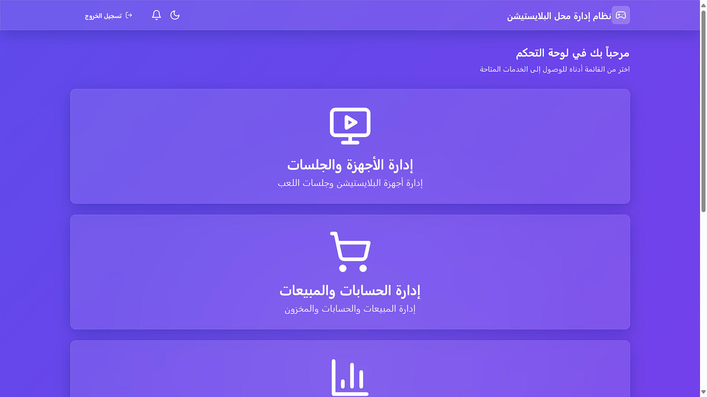
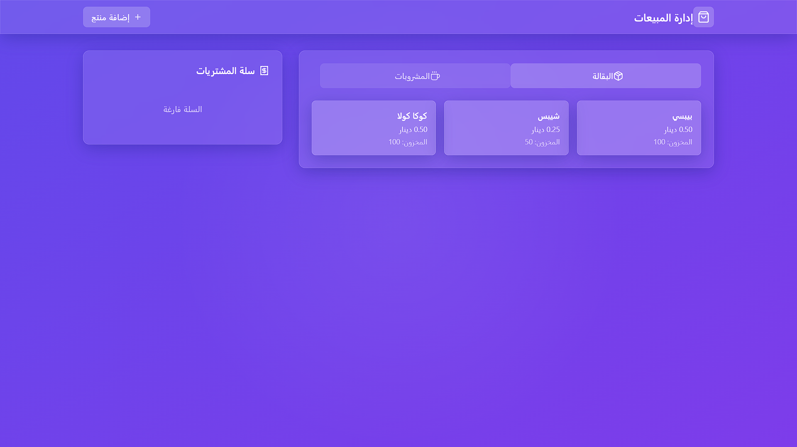

# 🎮 FRINDES – نظام إدارة محل بلايستيشن


## 📝 وصف المشروع

**FRINDES** هو تطبيق مكتبي ذكي ومفتوح المصدر لإدارة محل بلايستيشن صغير إلى متوسط.  
تم تطويره باستخدام: **React + TypeScript + Supabase**

يهدف إلى:
- تبسيط إدارة الجلسات والمبيعات.
- تقليل الخطأ البشري.
- توفير لوحة تحكم تفاعلية لصاحب المحل.

---

## 📸 صور من الواجهة

### 🧠 لوحة التحكم


### 🎮 إدارة الجلسات


### 📊 التقارير



---

## 🚀 خطوات تشغيل المشروع

```bash
git clone https://github.com/Zaidhr3/Ps_Mangment.git
cd Ps_Mangment
npm install
npm run dev
